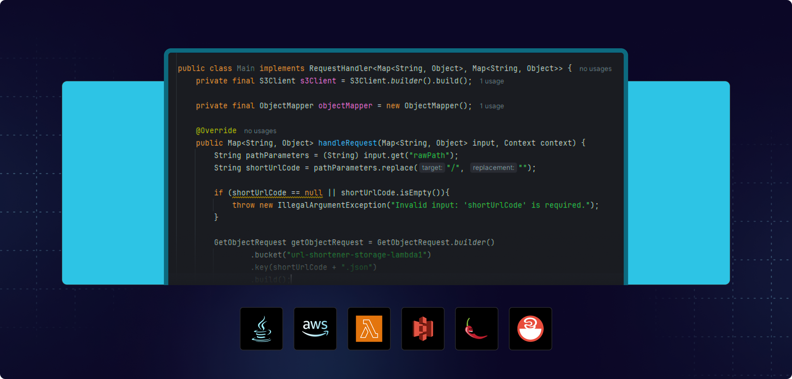

 
  
&#xa0;

<h1 align="center">Url Shortener</h1>

 

## :dart: About

A serverless URL shortening service built with AWS, using Lambda, API Gateway, DynamoDB, and S3. This project showcases how to build scalable, cost-efficient applications with cloud-native technologies. Developed during a free Rocketseat event, providing hands-on experience in serverless architecture.

## :rocket: Technologies

The following tools were used in this project:

- Java
- AWS
- Lambdas
- S3

## Lessons

- [x] Lesson 1
- [x] Lesson 2
- [ ] Lesson 3

Made with :heart: by <a href="https://github.com/davi1985" target="_blank">Davi Silva</a>

&#xa0;

<a href="#top">Back to top</a>
